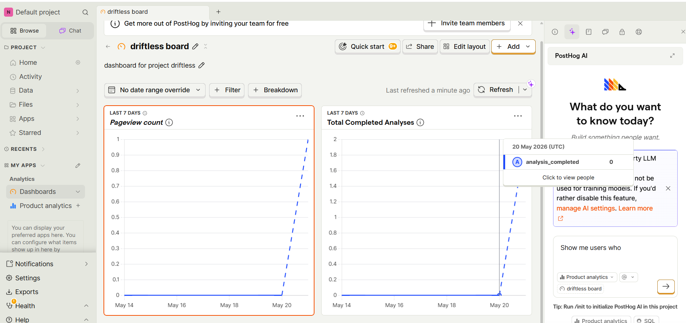

# Analytics Dashboard — Driftless

**Platform:** PostHog (posthog.com)  
**Tier:** Free  
**Events tracked:** Analysis sessions initiated, route cards rendered, TypeScript tab activated, copy button clicked

## Access

PostHog free tier does not support public dashboard sharing via URL. The project dashboard has been shared directly with the course instructor:

- **Shared with:** zeshan.ahmad@kiu.edu.ge (project member invite)
- **Events are live** and captured from https://driftless.nikatopu.dev/

## Events Schema

| Event name | Trigger | Properties captured |
|-----------|---------|---------------------|
| `analysis_completed` | Routes response received | route count, duration ms |
| `page view` | User visited website | — |
| `copy_button_clicked` | User clicks copy in TypeScript panel | — |
| `analysis_error` | API returns error | error type |

## Live Dashboard Screenshot
Below is a screenshot of the active PostHog dashboard showing real event data from user sessions:

